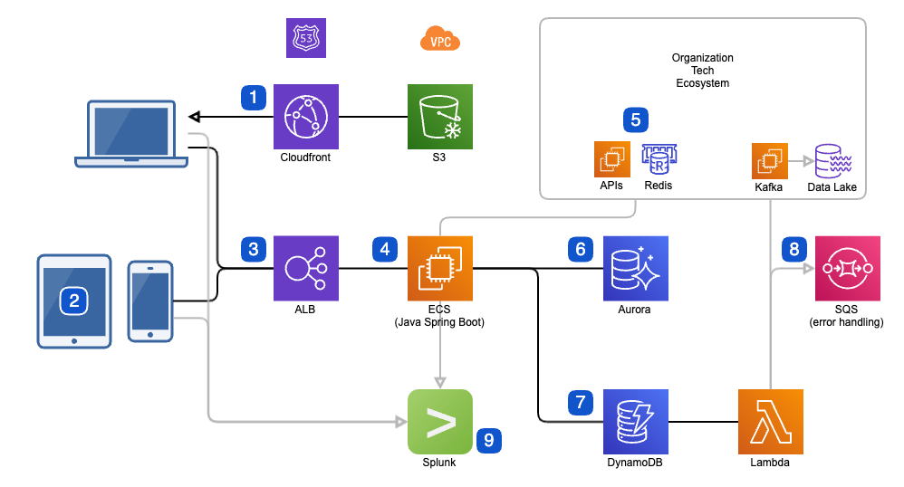
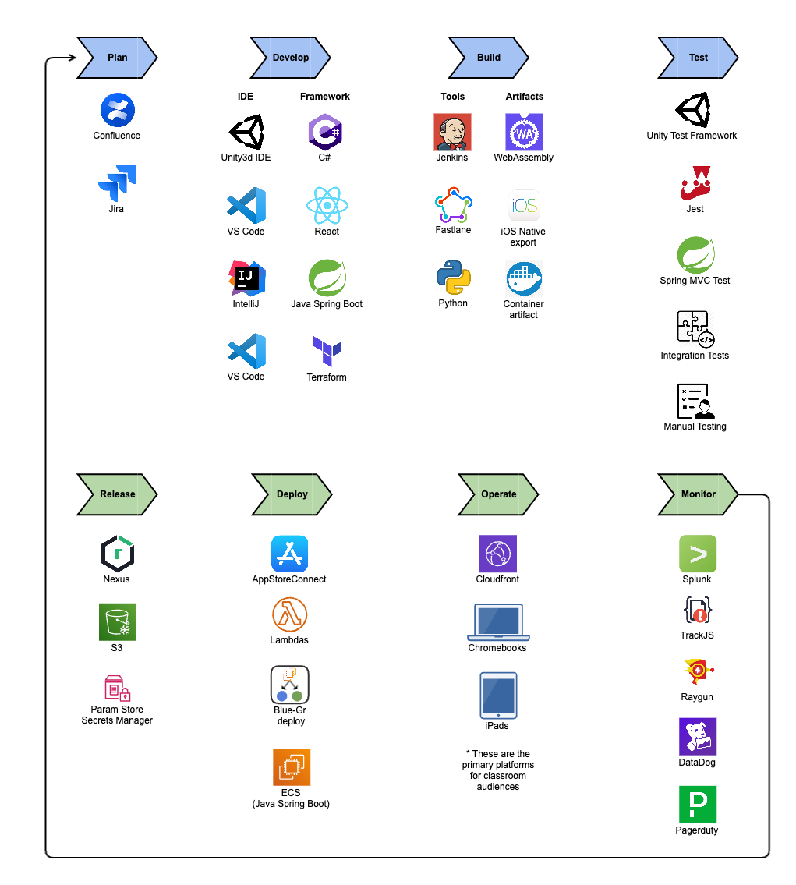

# Game Microservice Architecture and Pipeline
The following architecture and pipelines were used to create a microservice into a monolithic application. To best serve our users, we created cross-platform deployments to support Chromebook and iPad usage, and upon request, the systems would have easily ported to android. This architecture provides a scalable, performant, and flexible solution for building a cross-platform mobile game with a Java Spring Boot backend connected to both Aurora and DynamoDB databases and a frontend that utilizes WebAssembly embedded in a React page as well as native iOS apps.

## Architecture

1. The static game WebAssembly code and React web pages were served through Cloudfront via S3 to minimize latency. WebAssembly, a low-level binary format that allows for high-performance code execution in the browser, meant that the games had fast load times and better performance (exported from Unity3d).
2. In addition, the games were also deployed as a native iOS app with a Swift-C++ bridge (partially exported from Unity3d). This provided an optimized experience for iOS users.
3. The traffic was routed by an ALB, which enabled secure communication (TLS, JWT, and API keys) between the frontends and backend via REST APIs.
4. The backend ran on ECS, a managed container orchestration service that simplified the deployment, management, and scaling of containerized, high-performance applications, making it a good choice for  mobile games. The backend was containerized using Docker and then deployed to ECS, leveraging blue-green deploys to allow releases during near-peak usage. AWS services were provisioned using Terraform, a common Infrastructure as Code (IaC) tool. Codewise, the application used Java Spring Boot, a widely used framework for building enterprise-grade applications in Java.
5. As a microservice, the backend required services from the tech ecosystem communicating via APIs to get user information, and a JWT system leveraging Redis to improve security and provide common metadata for transactions and logging.
6. Aurora was used as a managed PostgreSQL-compatible relational DB for primary storage and leveraged Kinesis to send data to the data lake via Kafka.
7. DynamoDB (NoSQL DB) was used for temporary storage of data that would be ETL-ed via a Lambda pipeline to Kafka, then the data lake. Both DBs provided scalable, durable, and performant storage and flexibility for our different data types.
8. SQS was used as a dead-letter queue for exception handling of data that failed to send to Kafka for various reasons.
9. Most systems sent logging and metrics along with a common session identifier to Splunk for correlation across systems and to create KPI dashboards.

*Benefits:*
1. Scalability: Using Java Spring Boot on ECS allows the backend to scale up or down as needed to handle varying levels of traffic, ensuring a smooth user experience. It also provided multi-version concurrency control for older iOS app versions (institutional customers took longer to update.)
2. Security: The use of cloud best practices (e.g. VPCs and limited deployers of artifacts to production) in addition to REST apis secured by JWTs, API keys, and TLS ensured secure communications, reducing the risk of unauthorized access or data breaches.
3. Flexibility: The use of WebAssembly embedded in a React page as well as native iOS apps provides flexibility in terms of supporting multiple platforms.
4. Performance: We optimized web artifacts for download speed (small memory footprints served via CDN) and iOS for aesthetic beauty. The use of WebAssembly provides near-native performance, allowing the game to run smoothly and quickly in the browser. 
5. Ease of Deployment: The use of Parameter Store and Secrets Manager for managing configuration data and secrets, as well as the use of Cloudfront and S3 for serving static assets, simplifies the deployment process and reduces the potential for errors or misconfigurations.

## SDLC Pipeline

The entire SDLC pipeline along with the major tools and services we used are included below. Rather than exhaustively explain, here's some cool features:

1. The pipeline was optimized for 80% use cases, so much occurred automatically based on commits or clicking a build in Jenkins that had common defaults in the forms.
2. Our versioning system and deployments with SBOM (software bill of materials) summarized in JSON allowed us to know which artifacts were live. We used these to enable our build system to introspect the commit deltas between what was in development and prod.  This in turn meant that automated slack messages about new builds included the jira tickets addressed since the prior release.
3. Moreover, along with describing the jira tickets, the iOS outputs contained a QR code which allowed QA to download the chosen builds to their device by holding up the camera to the page on their screen.
4. The decoupled architecture above enabled us to create a one-click build deployment system that could deploy three systems (front-end, back-end, and the connection point between our system and the monolithic application) for three teams, in tandem or independently without downtime to any environment, including production. This I confirmed with all monitoring tools indicated.

