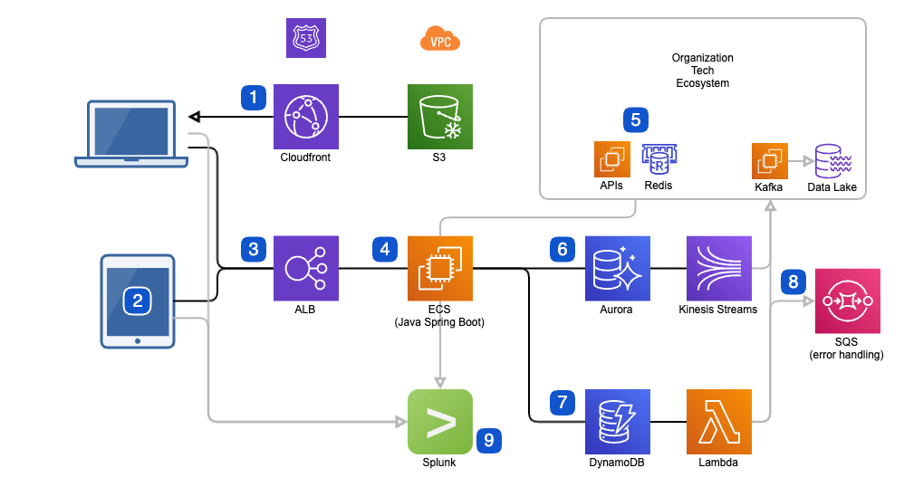

# Game Microservice Architecture and Pipeline
The following architecture and pipelines were used to create a microservice into a monolithic application (my mandate as a result of an acquisition of the company I cofounded). To best serve our teacher users, we created cross-platform deployments to Support Chromebook and iPad usage, and the systems would have easily ported to android, though sales did not drive us there.

## Architecture

*Benefits:*
1. Scalability: Using Java Spring Boot on ECS allows the backend to scale up or down as needed to handle varying levels of traffic, ensuring a smooth user experience. It also provided multi-version concurrency control for older iOS app versions (institutional customers took longer to update.)
2. Security: The use of cloud best practices (e.g. VPCs and limited deployers of artifacts to production) in addition to REST apis secured by JWTs, API keys, and TLS ensured secure communications, reducing the risk of unauthorized access or data breaches.
3. Flexibility: The use of WebAssembly embedded in a React page as well as native iOS apps provides flexibility in terms of supporting multiple platforms.
4. Performance: We optimized web artifacts for download speed (small memory footprints served via CDN) and iOS for aesthetic beauty. The use of WebAssembly provides near-native performance, allowing the game to run smoothly and quickly in the browser. 
5. Ease of Deployment: The use of Parameter Store and Secrets Manager for managing configuration data and secrets, as well as the use of Cloudfront and S3 for serving static assets, simplifies the deployment process and reduces the potential for errors or misconfigurations.

*Overview:*
This architecture provides a scalable, performant, and flexible solution for building a cross-platform mobile game with a Java Spring Boot backend connected to both Aurora and DynamoDB databases and a frontend that utilizes WebAssembly embedded in a React page as well as native iOS apps.

*Backend Architecture:*
* Java Spring Boot: A widely used framework for building enterprise-grade applications in Java. It provides a robust set of tools for building scalable and high-performance applications, making it a good choice for mobile games backends.
* Amazon Elastic Container Service (ECS): This managed container orchestration service simplified the deployment, management, and scaling of our containerized applications..
* Aurora and DynamoDB DBs: We used Aurora as a managed PostgreSQL-compatible relational DB for primary storage while DynamoDB (NoSQL DB) was used for temporary storage of data that would be ETL-ed via a Lambda pipeline to Kafka then the data lake. Both provided scalable, durable, and performant storage and flexibility for our different data types.

*Frontend Architecture:*
* React: Used as the primary front-end language in the organization, we used it mainly as a responsive container for the WebAssembly artifacts.
* WebAssembly: A low-level binary format that allows for high-performance code execution in the browser, meaning the games had fast load times and better performance (exported from Unity3d.)
* Native iOS apps: The games were also deployed in a native iOS app with a Swift-C++ bridge (partially exported from Unity3d.) This provided an optimized experience for iOS users.

Communication between the frontend and backend was achieved through REST APIs that used TLS, JWT, and API keys for security. The backend was containerized using Docker and then deployed to ECS leveraging blue-green deploys to allow deploys to occur during near-peak usage. AWS services were provisioned using Terraform, a common Infrastructure as Code (IaC) tool.

## SDLC Pipeline

The entire SDLC pipeline along with the major tools and services we used are included below. Rather than exhaustively explain, here's some cool features:

1. The pipeline was optimized for 80% use cases, so much occurred automatically based on commits or clicking a build in Jenkins that had common defaults in the forms.
2. Our versioning system and deployments with SBOM (software bill of materials) summarized in JSON allowed us to know which artifacts were live. We used these to enable our build system to introspect the commit deltas between what was in development and prod.  This in turn meant that automated slack messages about new builds included the jira tickets addressed since the prior release.
3. Moreover, along with describing the jira tickets, the iOS outputs contained a QR code which allowed QA to download the chosen builds to their device by holding up the camera to the page on their screen.
4. The decoupled architecture above enabled us to create a one-click build deployment system that could deploy three systems (front-end, back-end, and the connection point between our system and the monolithic application) for three teams, in tandem or independently without downtime to any environment, including production. This I confirmed with all monitoring tools indicated.

